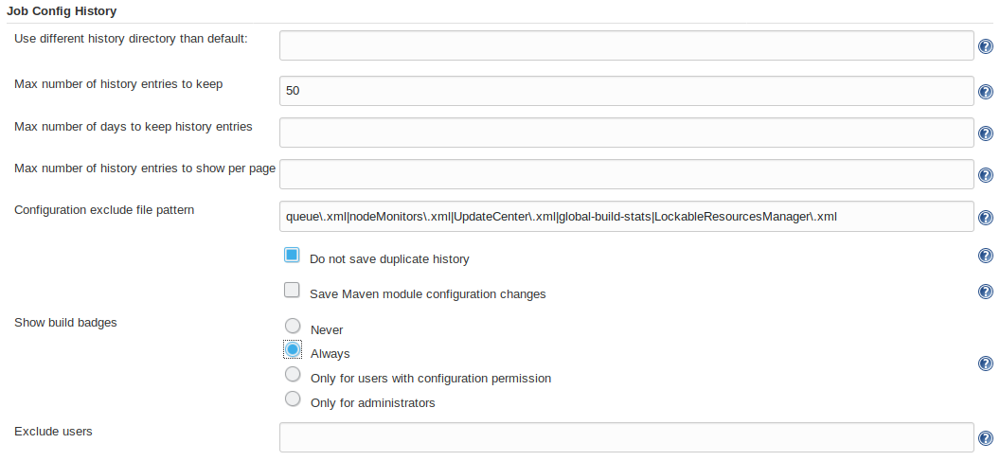

Job Configuration History Plugin
==============================

Saves copies of all job and system configurations.

Older versions of this plugin may not be safe to use. Please review the following warnings before using an older version:
* [Reflected Cross Site Scripting vulnerability](https://jenkins.io/security/advisory/2018-09-25/#SECURITY-1130)

This plugin saves **a copy of the configuration file** of jobs and agents (`config.xml`) for every change made and of the system configuration (`<config-name>.xml`).
You can also see what changes have been made by which user if you configured a security policy.

It is also possible to get a **side-by-side view** of the differences between two configurations and to restore an old version of a job's configuration. (The latter is only available for jobs, not for system changes.)
However, if you restore an older version of the config file and the new version contains fields that were not present in the older version, the restored version will still contain these fields, although they were not present in the original.

The plugin also provides an **overview page** of all changes. You can find it under `<jenkins_url>/jobConfigHistory` or reach it via links in the sidepanel of the main and the system configuration pages.
The overview page initially only lists system configuration changes (for performance reasons), but there are links to view either all job configuration histories or just the deleted jobs or all kinds of configuration history entries together (which may take some time to load, depending on the number of jobs in your instance).

------------------------------------------------------------------------

# Pictures

#### Job Config History Revision Overview

#### Job Diff Side-By-Side View

 

#### Config Overview Page

------------------------------------------------------------------------

# Interdependencies with other Plugins/ Excluding config path parts (jobs, folders, ...)

If you use other plugins, that are (automatically) changing the configuration, you might end up with a lot of unwanted change detections.

It's recommended to use the given ability, to exclude such changes by patterns. This can be done in the System Configuration or via `<jenkins-link>/configure`. Just add the corresponding pattern (e.g. cluster-stats) in the input **Configuration exclude file pattern**:

This functionality also allows you to exclude jobs, folders or other parts of your job hierarchy:
The pattern is attempted to be found in a config file's file path. Adding `|test` to the pattern will also cause `testFolder/jobs/job1` to be excluded.
So if you want to exclude jobs, only, it might be better to enter something like `|testJob/config\.xml`.

If you use this plugin together with the [Global Build Stats Plugin](https://plugins.jenkins.io/Global+Build+Stats+Plugin) you should add `global-build-stats` to the excludes in the **Configuration exclude file pattern** section of this plugin in **Configure System** page. Fixed in version 1.9 of the plugin.

If you use this plugin together with the [Cluster Statistics Plugin](https://plugins.jenkins.io/Cluster+Statistics+Plugin) you should add `cluster-stats` to the excludes in the **Configuration exclude file pattern** section of this plugin in **Configure System** page. Otherwise it might exceed your storage.

------------------------------------------------------------------------

# Open Issues

* See [open issues](https://issues.jenkins-ci.org/secure/IssueNavigator.jspa?mode=hide&reset=true&jqlQuery=project+%3D+JENKINS+AND+status+in+%28Open%2C+%22In+Progress%22%2C+Reopened%29+AND+component+%3D+%27jobconfighistory-plugin%27) on issues.jenkins-ci.org.

------------------------------------------------------------------------

# Changelog

See
[Changelog](https://github.com/jenkinsci/jobConfigHistory-plugin/blob/master/CHANGELOG.md)
on Github.

------------------------------------------------------------------------
# Notes

* This plugin uses *highlight.js* for syntax highlighting (code and diffs). See
    + [github](https://github.com/highlightjs/highlight.js/)
    + [homepage](https://highlightjs.org/)
    
* Development: Make `hpi:run` work with shared libraries
    * install shared library plugin (if not installed already)
    * install git (if you want to use the shared library plugin with git)